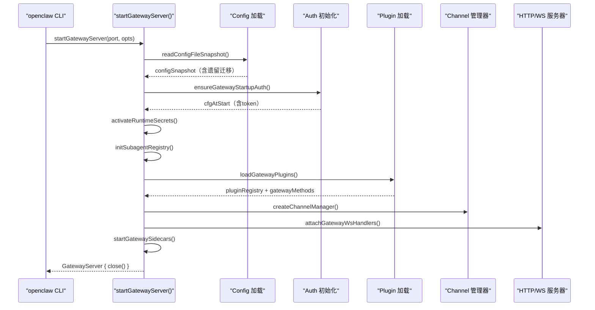

# OpenClaw 业务流程与代码逻辑详细教程

> ⚠️ **关于 PDF 输出**：本工具目前只能输出 Markdown 格式的文字。你可以将本页内容复制到 Typora、Pandoc、Notion 等工具中一键导出为 PDF。推荐使用 `pandoc tutorial.md -o tutorial.pdf --pdf-engine=xelatex` 命令（需要安装 LaTeX）。

---

## 一、项目整体架构概览

OpenClaw 是一个**多渠道 AI 智能体网关平台**，它将各种即时通讯渠道（Telegram、Slack、Discord、WhatsApp、iMessage、Signal 等）与多个 LLM 供应商（Anthropic、OpenAI、Gemini、Ollama 等）桥接在一起，并提供插件、技能（Skills）、定时任务（Cron）、记忆（Memory）等高级功能。

### 1.1 顶层目录结构

```
openclaw/
├── src/            ← 核心源码（TypeScript）
│   ├── gateway/    ← HTTP/WS 服务器、鉴权、配置重载
│   ├── agents/     ← AI Agent 引擎（模型调用、工具、子智能体）
│   ├── channels/   ← 渠道抽象层（Telegram/Slack/Discord 等）
│   ├── commands/   ← CLI 命令实现
│   ├── config/     ← 配置读写、Schema、验证
│   ├── plugins/    ← 插件系统（Hook 生命周期）
│   ├── memory/     ← 向量记忆系统
│   ├── routing/    ← Session Key 路由
│   ├── cron/       ← 定时任务引擎
│   └── ...
├── skills/         ← 内置 Skill 包（Spotify、Notion、GitHub 等）
├── packages/       ← 独立包（clawdbot、moltbot）
└── apps/           ← 移动端 App（iOS/macOS/Android）
```

---

## 二、Gateway 服务器启动流程

整个系统的入口是 `startGatewayServer()` 函数，位于 `src/gateway/server.impl.ts`。

### 2.1 启动时序图



### 2.2 关键初始化步骤详解

**步骤 1：配置加载与遗留迁移**

服务器启动时首先读取配置文件快照，如果存在遗留配置字段，会自动调用 `migrateLegacyConfig()` 进行迁移并写回磁盘。 [1](#0-0)

**步骤 2：插件自动启用**

通过环境变量检查，对满足条件的插件调用 `applyPluginAutoEnable()` 自动启用，并将结果写回配置文件。 [2](#0-1)

**步骤 3：Secrets（密钥）运行时快照**

调用 `prepareSecretsRuntimeSnapshot()` 预检所有密钥引用，如果必需密钥不可用则快速失败（fail-fast），随后通过 `activateSecretsRuntimeSnapshot()` 激活运行时快照。 [3](#0-2)

**步骤 4：子智能体注册表初始化**

`initSubagentRegistry()` 初始化全局子智能体注册表，用于管理所有正在运行的子 Agent 的生命周期。 [4](#0-3)

**步骤 5：侧车服务启动（`startGatewaySidecars`）**

包括：清理过期的 Session 锁文件、启动 Browser Control 服务器、启动 Gmail Watcher（如配置了钩子），以及启动插件服务（`startPluginServices`）。 [5](#0-4)

---

## 三、配置系统（Config）

配置系统是整个项目的核心基础设施，所有模块都依赖它。

### 3.1 配置文件管理

`src/config/config.ts` 是配置的统一出口，它重新导出了 `io.ts`（读写）、`legacy-migrate.ts`（迁移）、`paths.ts`（路径）、`validation.ts`（校验）等模块。 [6](#0-5)

**核心导出函数：**

- `loadConfig()` —— 加载当前运行时配置快照（带缓存）
- `readConfigFileSnapshot()` —— 直接从磁盘读取（不缓存）
- `writeConfigFile()` —— 原子写入配置文件
- `validateConfigObject()` —— 使用 Zod 验证配置对象

### 3.2 配置的 Schema 层次

`src/config/` 目录下的 `types.ts` 汇出了所有 TypeScript 类型，`zod-schema.ts` 定义了对应的 Zod 校验 Schema。配置类型按渠道细分，例如：

- `types.telegram.ts` → Telegram 专属配置
- `types.slack.ts` → Slack 专属配置
- `types.agents.ts` → Agent 并发/超时/沙箱配置

---

## 四、消息接收与路由流程

### 4.1 Session Key 路由系统

`src/routing/session-key.ts` 定义了消息路由的核心标识符格式：`{channel}:{agentId}:{accountId}:{senderId}`。每条进入系统的消息都会通过 Session Key 定位到正确的 Agent 和对话历史。

### 4.2 Channel Manager（渠道管理器）

`createChannelManager()` 在 `src/gateway/server-channels.ts` 中定义，负责：

- 管理每个渠道账户的运行时状态（`ChannelRuntimeStore`）
- 实现指数退避（`CHANNEL_RESTART_POLICY`）的渠道重启策略（最大重试 10 次）
- 当渠道配置变化时协调热重载 [7](#0-6)

### 4.3 Session 记录与路由更新

每条进入的消息通过 `recordInboundSession()` 在 `src/channels/session.ts` 中记录，同时更新 `lastRoute`（最后一次路由信息），使智能体后续主动发送消息时知道该发往哪里。 [8](#0-7)

### 4.4 Run State Machine（运行状态机）

`createRunStateMachine()` 在 `src/channels/run-state-machine.ts` 中实现，追踪每个渠道的当前活跃 Run 数量（`activeRuns`）和忙碌状态（`busy`），并通过心跳定时器周期性地向前端广播状态。 [9](#0-8)

---

## 五、Agent 命令执行流程（核心业务逻辑）

### 5.1 agentCommand 总入口

`src/commands/agent.ts` 中的 `agentCommand()` 是处理一条用户消息的总入口。它完成以下工作：

1. 解析 Agent ID 和 Session Key
2. 加载工作区目录（`ensureAgentWorkspace`）
3. 构建 Session 条目
4. 调用 `runEmbeddedPiAgent()`（最终 LLM 调用）
5. 将结果写回 Session Store
6. 通过 `deliverAgentCommandResult()` 投递回复 [10](#0-9)

### 5.2 runEmbeddedPiAgent 主循环（最核心流程）

`runEmbeddedPiAgent()` 位于 `src/agents/pi-embedded-runner/run.ts`，是真正驱动 LLM 推理的函数。

````mermaid
flowchart TD
    A["runEmbeddedPiAgent(params)"] --> B["enqueueSession + enqueueGlobal (Lane 队列)"]
    B --> C["解析 workspaceDir、sessionKey"]
    C --> D["ensureRuntimePluginsLoaded()"]
    D --> E["运行 before_model_resolve Hook"]
    E --> F["resolveModel() 解析模型"]
    F --> G["ensureAuthProfileStore() 加载认证档案"]
    G --> H["resolveAuthProfileOrder() 排序认证档案"]
    H --> I["applyApiKeyInfo() 设置 API Key"]
    I --> J["主运行循环 (最多 MAX_RUN_LOOP_ITERATIONS 次)"]
    J --> K["runEmbeddedAttempt() 发起一次 LLM 调用"]
    K -->|"成功"| L["mergeUsageIntoAccumulator()"]
    K -->|"上下文溢出"| M["compactEmbeddedPiSession() 压缩对话历史"]
    K -->|"认证错误"| N["advanceAuthProfile() 切换认证档案"]
    K -->|"速率限制"| O["OVERLOAD_FAILOVER_BACKOFF_POLICY 退避"]
    L --> P["返回 EmbeddedPiRunResult"]
``` [11](#0-10)

**Lane（通道）并发控制：**

系统用两级队列控制并发：`sessionLane`（每个 session 串行）+ `globalLane`（全局限流），保证同一对话不会出现并发 LLM 调用。 [12](#0-11)

### 5.3 认证档案轮转（Auth Profile Rotation）

系统支持多个 API Key 档案（`authProfiles`），当某个档案进入冷却期（cooldown，如触发了速率限制或账单错误），会自动通过 `advanceAuthProfile()` 切换到下一个档案，实现无感知的高可用。 [13](#0-12)

---

## 六、System Prompt 构建

`buildAgentSystemPrompt()` 在 `src/agents/system-prompt.ts` 中，动态组装发送给 LLM 的系统提示词，包含以下可配置区段：

| 区段 | 函数 | 说明 |
|------|------|------|
| Skills | `buildSkillsSection()` | 从工作区扫描到的技能列表 |
| Memory Recall | `buildMemorySection()` | 记忆召回指令 |
| Authorized Senders | `buildUserIdentitySection()` | 授权发送者 ID 列表 |
| Messaging | `buildMessagingSection()` | 如何使用 message/sessions_send 工具 |
| Reply Tags | `buildReplyTagsSection()` | `[[reply_to_current]]` 等回复标签 |
| Voice (TTS) | `buildVoiceSection()` | TTS 提示 |
| Documentation | `buildDocsSection()` | OpenClaw 文档路径 |

`PromptMode` 枚举控制包含哪些区段：`"full"`（主 Agent）、`"minimal"`（子 Agent）、`"none"`（仅身份行）。 [14](#0-13) [15](#0-14)

---

## 七、工具系统（Tools）

### 7.1 createOpenClawTools —— 工具注册

`createOpenClawTools()` 在 `src/agents/openclaw-tools.ts` 中，根据当前 Session 上下文动态构建 Agent 可用的工具列表，包括：

- `message` —— 向渠道发送消息
- `sessions_spawn` —— 创建子智能体 Session
- `sessions_send` —— 向其他 Session 发消息
- `sessions_yield` —— 当前 Session 让出结果
- `cron` —— 注册/取消定时任务
- `nodes` —— 调用远程节点命令
- `web_fetch` / `web_search` —— 网络工具
- `image` / `pdf` / `canvas` —— 媒体工具
- `tts` —— 文字转语音 [16](#0-15)

### 7.2 工具策略管道（Tool Policy Pipeline）

每次 LLM 请求工具调用时，系统会经过 `tool-policy-pipeline.ts` 中的多个策略层检查：
- **沙箱策略**：文件系统访问限制
- **审批策略**：危险操作需要用户确认（`exec_approval`）
- **角色策略**：基于发送者角色的权限控制

---

## 八、子智能体系统（Subagent System）

### 8.1 架构设计

OpenClaw 支持 Agent 动态地孵化子 Agent 来并行执行任务。核心注册表为 `src/agents/subagent-registry.ts`，维护一个全局 `Map<string, SubagentRunRecord>` 存储所有运行中的子 Agent。

```mermaid
graph TD
    Parent["父 Agent (sessions_spawn 工具)"] -->|"注册到"| Registry["SubagentRegistry\n(subagent-registry.ts)"]
    Registry -->|"派发"| Child1["子 Agent A"]
    Registry -->|"派发"| Child2["子 Agent B"]
    Child1 -->|"完成后 announce"| Registry
    Child2 -->|"完成后 announce"| Registry
    Registry -->|"回调父 Agent"| Parent
``` [17](#0-16)

### 8.2 子 Agent 生命周期

子 Agent 的最大通知超时为 120 秒（`SUBAGENT_ANNOUNCE_TIMEOUT_MS`），最大重试次数为 3 次（`MAX_ANNOUNCE_RETRY_COUNT`），使用指数退避（1s～8s）。深度限制防止无限递归孵化。 [18](#0-17)

---

## 九、对话历史压缩（Compaction）

当对话历史接近模型上下文窗口时，`compactEmbeddedPiSession()` 会被触发。

### 9.1 压缩流程

1. 用 `estimateTokens()` 估算当前历史的 Token 数
2. 按 `BASE_CHUNK_RATIO = 0.4` 和 `MIN_CHUNK_RATIO = 0.15` 分块
3. 对历史块调用 LLM 生成摘要，并遵循 `IDENTIFIER_PRESERVATION_INSTRUCTIONS`（保留所有不透明标识符如 UUID、哈希值）
4. 多个部分摘要合并为一个连贯摘要（`MERGE_SUMMARIES_INSTRUCTIONS`）
5. 将新摘要注入为会话起点 [19](#0-18)

---

## 十、插件与 Hook 系统

### 10.1 插件生命周期 Hook 列表

`src/plugins/hooks.ts` 定义了完整的 Hook 系统，插件可以在以下生命周期节点注入逻辑：

| Hook 名称 | 触发时机 |
|-----------|----------|
| `gateway_start` | Gateway 服务器启动时 |
| `gateway_stop` | Gateway 服务器关闭时 |
| `before_model_resolve` | 模型选择前（可覆盖 provider/model） |
| `before_agent_start` | Agent 开始前（旧版兼容） |
| `before_prompt_build` | 构建 Prompt 前 |
| `llm_input` | 发送给 LLM 前 |
| `llm_output` | LLM 返回后 |
| `before_tool_call` | 工具调用前（可阻止） |
| `after_tool_call` | 工具调用后 |
| `before_compaction` | 上下文压缩前 |
| `after_compaction` | 上下文压缩后 |
| `message_received` | 收到消息时 |
| `message_sending` | 发送消息前（可修改内容） |
| `message_sent` | 消息发送成功后 |
| `session_start` | Session 开始时 |
| `session_end` | Session 结束时 |
| `subagent_spawning` | 子 Agent 被孵化时 |
| `subagent_spawned` | 子 Agent 孵化成功后 |
| `subagent_ended` | 子 Agent 结束时 | [20](#0-19)

### 10.2 插件工具注册

插件通过 `OpenClawPluginToolFactory` 类型（接受 `OpenClawPluginToolContext`，返回 `AnyAgentTool[]`）向 Agent 注入自定义工具，工具上下文包含 `config`、`workspaceDir`、`agentId`、`sessionKey`、`sessionId` 等字段。 [21](#0-20)

---

## 十一、记忆系统（Memory）

记忆系统位于 `src/memory/`，提供基于向量嵌入的语义检索能力。

### 11.1 架构

```mermaid
graph LR
    Agent["Agent\n(memory_search tool)"] -->|"查询"| SearchMgr["search-manager.ts"]
    SearchMgr -->|"扩展查询"| QueryExp["query-expansion.ts"]
    SearchMgr -->|"向量检索"| Manager["manager.ts\n(MemoryManager)"]
    Manager -->|"嵌入生成"| EmbProvider["Embedding Provider\n(OpenAI/Gemini/Voyage/Ollama)"]
    Manager -->|"存储"| SQLite["SQLite + sqlite-vec\n(本地向量索引)"]
    Manager -->|"批量嵌入"| BatchRunner["batch-runner.ts\n(批量异步处理)"]
````

记忆文件基于 Markdown（`MEMORY.md` 和 `memory/*.md`），系统通过文件系统 Watcher 自动检测变更并重新索引。

支持的嵌入供应商（`src/memory/`）：

- `embeddings-openai.ts` — OpenAI text-embedding-\*
- `embeddings-gemini.ts` — Google Gemini Embedding
- `embeddings-ollama.ts` — 本地 Ollama 模型
- `embeddings-voyage.ts` — Voyage AI
- `embeddings-mistral.ts` — Mistral

---

## 十二、定时任务系统（Cron）

`src/gateway/server-cron.ts` 中的 `buildGatewayCronService()` 初始化定时任务服务，每条 Cron Job 执行时：

1. 通过 `runCronIsolatedAgentTurn()` 独立运行一个 Agent 回合
2. 通过 `resolveDeliveryTarget()` 确定结果投递目标
3. 失败时通过 `sendFailureNotificationAnnounce()` 发送失败通知
4. 通过 `appendCronRunLog()` 追加运行日志（支持自动 prune）
5. 可选地向 Webhook URL 推送结果（`CRON_WEBHOOK_TIMEOUT_MS = 10000ms`） [22](#0-21)

---

## 十三、Boot 启动检查（BOOT.md）

系统启动时会在工作区目录查找 `BOOT.md` 文件，若存在且非空，`runBootOnce()` 会：

1. 读取文件内容
2. 用 `buildBootPrompt()` 构建专用提示词，指示 Agent 按 BOOT.md 指令行事
3. 以一个独立的 Session（ID 格式 `boot-{timestamp}-{uuid}`）运行 Agent
4. 完成后**恢复原始 Session 映射**（通过快照机制，避免 BOOT 运行污染正常会话历史） [23](#0-22) [24](#0-23)

---

## 十四、OpenAI 兼容 API（OpenResponses / Chat Completions）

Gateway 提供了两个 OpenAI 兼容的 HTTP 端点，允许第三方应用像调用 OpenAI API 一样调用 OpenClaw：

- `POST /v1/chat/completions`（通过 `openAiChatCompletionsEnabled` 配置开关）
- `POST /v1/responses`（OpenResponses API，通过 `openResponsesEnabled` 配置开关） [25](#0-24)

---

## 十五、LLM 流式响应处理（subscribeEmbeddedPiSession）

`subscribeEmbeddedPiSession()` 在 `src/agents/pi-embedded-subscribe.ts` 中处理 LLM 流式输出，维护大量状态用于：

- **Reasoning（思维链）过滤**：识别并可选地过滤 `<think>` / `<thinking>` 标签
- **Block Reply 分块**：按段落/`text_end` 事件分批发送回复（避免等待整个响应）
- **工具调用追踪**：追踪 `toolMetas` 和 `toolMetaById` 保证工具调用幂等性
- **Messaging Tool 去重**：通过 `isMessagingToolDuplicateNormalized()` 避免重复发送消息
- **压缩重试**：`compactionInFlight` + `pendingCompactionRetry` 状态机协调压缩与流式输出 [26](#0-25)

---

## 十六、完整的消息处理端到端流程

```mermaid
sequenceDiagram
    participant User as "用户 (Telegram等)"
    participant Channel as "渠道插件\n(e.g., Telegram)"
    participant GW as "Gateway"
    participant Agent as "agentCommand()"
    participant Run as "runEmbeddedPiAgent()"
    participant Hook as "Plugin Hooks"
    participant LLM as "LLM API"
    participant Tools as "工具执行层"
    participant Store as "SessionStore"

    User->>Channel: 发送消息
    Channel->>GW: 路由 → 找到 sessionKey
    GW->>Agent: agentCommand({ message, sessionKey })
    Agent->>Hook: message_received hook
    Agent->>Run: runEmbeddedPiAgent(params)
    Run->>Hook: before_model_resolve hook
    Run->>Run: resolveModel() + resolveAuthProfileOrder()
    Run->>Hook: before_prompt_build hook
    Run->>Run: buildAgentSystemPrompt()
    Run->>Hook: llm_input hook
    Run->>LLM: API 请求（流式）
    LLM-->>Run: 流式 token
    Run->>Hook: llm_output hook
    alt 工具调用
        Run->>Hook: before_tool_call hook
        Run->>Tools: 执行工具
        Tools-->>Run: 工具结果
        Run->>Hook: after_tool_call hook
        Run->>LLM: 继续对话（tool_result）
    end
    Run-->>Agent: EmbeddedPiRunResult
    Agent->>Store: updateSessionStore()
    Agent->>Hook: session_end hook
    Agent->>Channel: deliverAgentCommandResult()
    Channel-->>User: 回复消息
```

---

## 十七、关键数据类型速查

### `EmbeddedPiRunResult`（Agent 运行结果） [27](#0-26)

### `EmbeddedSandboxInfo`（沙箱配置）

<cite repo="openc

### Citations

**File:** src/gateway/server.impl.ts (L236-265)

```typescript
   * If false, do not serve `POST /v1/chat/completions`.
   * Default: config `gateway.http.endpoints.chatCompletions.enabled` (or false when absent).
   */
  openAiChatCompletionsEnabled?: boolean;
  /**
   * If false, do not serve `POST /v1/responses` (OpenResponses API).
   * Default: config `gateway.http.endpoints.responses.enabled` (or false when absent).
   */
  openResponsesEnabled?: boolean;
  /**
   * Override gateway auth configuration (merges with config).
   */
  auth?: import("../config/config.js").GatewayAuthConfig;
  /**
   * Override gateway Tailscale exposure configuration (merges with config).
   */
  tailscale?: import("../config/config.js").GatewayTailscaleConfig;
  /**
   * Test-only: allow canvas host startup even when NODE_ENV/VITEST would disable it.
   */
  allowCanvasHostInTests?: boolean;
  /**
   * Test-only: override the onboarding wizard runner.
   */
  wizardRunner?: (
    opts: import("../commands/onboard-types.js").OnboardOptions,
    runtime: import("../runtime.js").RuntimeEnv,
    prompter: import("../wizard/prompts.js").WizardPrompter,
  ) => Promise<void>;
};
```

**File:** src/gateway/server.impl.ts (L285-307)

```typescript
let configSnapshot = await readConfigFileSnapshot();
if (configSnapshot.legacyIssues.length > 0) {
  if (isNixMode) {
    throw new Error(
      "Legacy config entries detected while running in Nix mode. Update your Nix config to the latest schema and restart.",
    );
  }
  const { config: migrated, changes } = migrateLegacyConfig(configSnapshot.parsed);
  if (!migrated) {
    log.warn(
      "gateway: legacy config entries detected but no auto-migration changes were produced; continuing with validation.",
    );
  } else {
    await writeConfigFile(migrated);
    if (changes.length > 0) {
      log.info(
        `gateway: migrated legacy config entries:\n${changes
          .map((entry) => `- ${entry}`)
          .join("\n")}`,
      );
    }
  }
}
```

**File:** src/gateway/server.impl.ts (L320-332)

```typescript
const autoEnable = applyPluginAutoEnable({ config: configSnapshot.config, env: process.env });
if (autoEnable.changes.length > 0) {
  try {
    await writeConfigFile(autoEnable.config);
    log.info(
      `gateway: auto-enabled plugins:\n${autoEnable.changes
        .map((entry) => `- ${entry}`)
        .join("\n")}`,
    );
  } catch (err) {
    log.warn(`gateway: failed to persist plugin auto-enable changes: ${String(err)}`);
  }
}
```

**File:** src/gateway/server.impl.ts (L354-398)

```typescript
const activateRuntimeSecrets = async (
  config: OpenClawConfig,
  params: { reason: "startup" | "reload" | "restart-check"; activate: boolean },
) =>
  await runWithSecretsActivationLock(async () => {
    try {
      const prepared = await prepareSecretsRuntimeSnapshot({ config });
      if (params.activate) {
        activateSecretsRuntimeSnapshot(prepared);
        logGatewayAuthSurfaceDiagnostics(prepared);
      }
      for (const warning of prepared.warnings) {
        logSecrets.warn(`[${warning.code}] ${warning.message}`);
      }
      if (secretsDegraded) {
        const recoveredMessage =
          "Secret resolution recovered; runtime remained on last-known-good during the outage.";
        logSecrets.info(`[SECRETS_RELOADER_RECOVERED] ${recoveredMessage}`);
        emitSecretsStateEvent("SECRETS_RELOADER_RECOVERED", recoveredMessage, prepared.config);
      }
      secretsDegraded = false;
      return prepared;
    } catch (err) {
      const details = String(err);
      if (!secretsDegraded) {
        logSecrets.error(`[SECRETS_RELOADER_DEGRADED] ${details}`);
        if (params.reason !== "startup") {
          emitSecretsStateEvent(
            "SECRETS_RELOADER_DEGRADED",
            `Secret resolution failed; runtime remains on last-known-good snapshot. ${details}`,
            config,
          );
        }
      } else {
        logSecrets.warn(`[SECRETS_RELOADER_DEGRADED] ${details}`);
      }
      secretsDegraded = true;
      if (params.reason === "startup") {
        throw new Error(`Startup failed: required secrets are unavailable. ${details}`, {
          cause: err,
        });
      }
      throw err;
    }
  });
```

**File:** src/gateway/server.impl.ts (L466-479)

```typescript
initSubagentRegistry();
const defaultAgentId = resolveDefaultAgentId(cfgAtStart);
const defaultWorkspaceDir = resolveAgentWorkspaceDir(cfgAtStart, defaultAgentId);
const baseMethods = listGatewayMethods();
const emptyPluginRegistry = createEmptyPluginRegistry();
const { pluginRegistry, gatewayMethods: baseGatewayMethods } = minimalTestGateway
  ? { pluginRegistry: emptyPluginRegistry, gatewayMethods: baseMethods }
  : loadGatewayPlugins({
      cfg: cfgAtStart,
      workspaceDir: defaultWorkspaceDir,
      log,
      coreGatewayHandlers,
      baseMethods,
    });
```

**File:** src/gateway/server-startup.ts (L34-80)

```typescript
export async function startGatewaySidecars(params: {
  cfg: ReturnType<typeof loadConfig>;
  pluginRegistry: ReturnType<typeof loadOpenClawPlugins>;
  defaultWorkspaceDir: string;
  deps: CliDeps;
  startChannels: () => Promise<void>;
  log: { warn: (msg: string) => void };
  logHooks: {
    info: (msg: string) => void;
    warn: (msg: string) => void;
    error: (msg: string) => void;
  };
  logChannels: { info: (msg: string) => void; error: (msg: string) => void };
  logBrowser: { error: (msg: string) => void };
}) {
  try {
    const stateDir = resolveStateDir(process.env);
    const sessionDirs = await resolveAgentSessionDirs(stateDir);
    for (const sessionsDir of sessionDirs) {
      await cleanStaleLockFiles({
        sessionsDir,
        staleMs: SESSION_LOCK_STALE_MS,
        removeStale: true,
        log: { warn: (message) => params.log.warn(message) },
      });
    }
  } catch (err) {
    params.log.warn(`session lock cleanup failed on startup: ${String(err)}`);
  }

  // Start OpenClaw browser control server (unless disabled via config).
  let browserControl: Awaited<ReturnType<typeof startBrowserControlServerIfEnabled>> = null;
  try {
    browserControl = await startBrowserControlServerIfEnabled();
  } catch (err) {
    params.logBrowser.error(`server failed to start: ${String(err)}`);
  }

  // Start Gmail watcher if configured (hooks.gmail.account).
  await startGmailWatcherWithLogs({
    cfg: params.cfg,
    log: params.logHooks,
  });

  // Validate hooks.gmail.model if configured.
  if (params.cfg.hooks?.gmail?.model) {
    const hooksModelRef = resolveHooksGmailModel({
```

**File:** src/config/config.ts (L1-28)

```typescript
export {
  clearConfigCache,
  ConfigRuntimeRefreshError,
  clearRuntimeConfigSnapshot,
  createConfigIO,
  getRuntimeConfigSnapshot,
  getRuntimeConfigSourceSnapshot,
  projectConfigOntoRuntimeSourceSnapshot,
  loadConfig,
  readBestEffortConfig,
  parseConfigJson5,
  readConfigFileSnapshot,
  readConfigFileSnapshotForWrite,
  resolveConfigSnapshotHash,
  setRuntimeConfigSnapshotRefreshHandler,
  setRuntimeConfigSnapshot,
  writeConfigFile,
} from "./io.js";
export { migrateLegacyConfig } from "./legacy-migrate.js";
export * from "./paths.js";
export * from "./runtime-overrides.js";
export * from "./types.js";
export {
  validateConfigObject,
  validateConfigObjectRaw,
  validateConfigObjectRawWithPlugins,
  validateConfigObjectWithPlugins,
} from "./validation.js";
```

**File:** src/gateway/server-channels.ts (L13-57)

```typescript
const CHANNEL_RESTART_POLICY: BackoffPolicy = {
  initialMs: 5_000,
  maxMs: 5 * 60_000,
  factor: 2,
  jitter: 0.1,
};
const MAX_RESTART_ATTEMPTS = 10;

export type ChannelRuntimeSnapshot = {
  channels: Partial<Record<ChannelId, ChannelAccountSnapshot>>;
  channelAccounts: Partial<Record<ChannelId, Record<string, ChannelAccountSnapshot>>>;
};

type SubsystemLogger = ReturnType<typeof createSubsystemLogger>;

type ChannelRuntimeStore = {
  aborts: Map<string, AbortController>;
  tasks: Map<string, Promise<unknown>>;
  runtimes: Map<string, ChannelAccountSnapshot>;
};

function createRuntimeStore(): ChannelRuntimeStore {
  return {
    aborts: new Map(),
    tasks: new Map(),
    runtimes: new Map(),
  };
}

function isAccountEnabled(account: unknown): boolean {
  if (!account || typeof account !== "object") {
    return true;
  }
  const enabled = (account as { enabled?: boolean }).enabled;
  return enabled !== false;
}

function resolveDefaultRuntime(channelId: ChannelId): ChannelAccountSnapshot {
  const plugin = getChannelPlugin(channelId);
  return plugin?.status?.defaultRuntime ?? { accountId: DEFAULT_ACCOUNT_ID };
}

function cloneDefaultRuntime(channelId: ChannelId, accountId: string): ChannelAccountSnapshot {
  return { ...resolveDefaultRuntime(channelId), accountId };
}
```

**File:** src/channels/session.ts (L41-80)

```typescript
export async function recordInboundSession(params: {
  storePath: string;
  sessionKey: string;
  ctx: MsgContext;
  groupResolution?: GroupKeyResolution | null;
  createIfMissing?: boolean;
  updateLastRoute?: InboundLastRouteUpdate;
  onRecordError: (err: unknown) => void;
}): Promise<void> {
  const { storePath, sessionKey, ctx, groupResolution, createIfMissing } = params;
  const canonicalSessionKey = normalizeSessionStoreKey(sessionKey);
  void recordSessionMetaFromInbound({
    storePath,
    sessionKey: canonicalSessionKey,
    ctx,
    groupResolution,
    createIfMissing,
  }).catch(params.onRecordError);

  const update = params.updateLastRoute;
  if (!update) {
    return;
  }
  if (shouldSkipPinnedMainDmRouteUpdate(update.mainDmOwnerPin)) {
    return;
  }
  const targetSessionKey = normalizeSessionStoreKey(update.sessionKey);
  await updateLastRoute({
    storePath,
    sessionKey: targetSessionKey,
    deliveryContext: {
      channel: update.channel,
      to: update.to,
      accountId: update.accountId,
      threadId: update.threadId,
    },
    // Avoid leaking inbound origin metadata into a different target session.
    ctx: targetSessionKey === canonicalSessionKey ? ctx : undefined,
    groupResolution,
  });
```

**File:** src/channels/run-state-machine.ts (L18-80)

```typescript
export function createRunStateMachine(params: RunStateMachineParams) {
  const heartbeatMs = params.heartbeatMs ?? DEFAULT_RUN_ACTIVITY_HEARTBEAT_MS;
  const now = params.now ?? Date.now;
  let activeRuns = 0;
  let runActivityHeartbeat: ReturnType<typeof setInterval> | null = null;
  let lifecycleActive = !params.abortSignal?.aborted;

  const publish = () => {
    if (!lifecycleActive) {
      return;
    }
    params.setStatus?.({
      activeRuns,
      busy: activeRuns > 0,
      lastRunActivityAt: now(),
    });
  };

  const clearHeartbeat = () => {
    if (!runActivityHeartbeat) {
      return;
    }
    clearInterval(runActivityHeartbeat);
    runActivityHeartbeat = null;
  };

  const ensureHeartbeat = () => {
    if (runActivityHeartbeat || activeRuns <= 0 || !lifecycleActive) {
      return;
    }
    runActivityHeartbeat = setInterval(() => {
      if (!lifecycleActive || activeRuns <= 0) {
        clearHeartbeat();
        return;
      }
      publish();
    }, heartbeatMs);
    runActivityHeartbeat.unref?.();
  };

  const deactivate = () => {
    lifecycleActive = false;
    clearHeartbeat();
  };

  const onAbort = () => {
    deactivate();
  };

  if (params.abortSignal?.aborted) {
    onAbort();
  } else {
    params.abortSignal?.addEventListener("abort", onAbort, { once: true });
  }

  if (lifecycleActive) {
    // Reset inherited status from previous process lifecycle.
    params.setStatus?.({
      activeRuns: 0,
      busy: false,
    });
  }

```

**File:** src/commands/agent.ts (L1-96)

```typescript
import fs from "node:fs/promises";
import { SessionManager } from "@mariozechner/pi-coding-agent";
import { getAcpSessionManager } from "../acp/control-plane/manager.js";
import { resolveAcpAgentPolicyError, resolveAcpDispatchPolicyError } from "../acp/policy.js";
import { toAcpRuntimeError } from "../acp/runtime/errors.js";
import { resolveAcpSessionCwd } from "../acp/runtime/session-identifiers.js";
import { createSubsystemLogger } from "../logging/subsystem.js";

const log = createSubsystemLogger("commands/agent");
import {
  listAgentIds,
  resolveAgentDir,
  resolveEffectiveModelFallbacks,
  resolveSessionAgentId,
  resolveAgentSkillsFilter,
  resolveAgentWorkspaceDir,
} from "../agents/agent-scope.js";
import { ensureAuthProfileStore } from "../agents/auth-profiles.js";
import { clearSessionAuthProfileOverride } from "../agents/auth-profiles/session-override.js";
import { resolveBootstrapWarningSignaturesSeen } from "../agents/bootstrap-budget.js";
import { runCliAgent } from "../agents/cli-runner.js";
import { getCliSessionId, setCliSessionId } from "../agents/cli-session.js";
import { DEFAULT_MODEL, DEFAULT_PROVIDER } from "../agents/defaults.js";
import { FailoverError } from "../agents/failover-error.js";
import { formatAgentInternalEventsForPrompt } from "../agents/internal-events.js";
import { AGENT_LANE_SUBAGENT } from "../agents/lanes.js";
import { loadModelCatalog } from "../agents/model-catalog.js";
import { runWithModelFallback } from "../agents/model-fallback.js";
import {
  buildAllowedModelSet,
  isCliProvider,
  modelKey,
  normalizeModelRef,
  normalizeProviderId,
  resolveConfiguredModelRef,
  resolveDefaultModelForAgent,
  resolveThinkingDefault,
} from "../agents/model-selection.js";
import { prepareSessionManagerForRun } from "../agents/pi-embedded-runner/session-manager-init.js";
import { runEmbeddedPiAgent } from "../agents/pi-embedded.js";
import { buildWorkspaceSkillSnapshot } from "../agents/skills.js";
import { getSkillsSnapshotVersion } from "../agents/skills/refresh.js";
import { normalizeSpawnedRunMetadata } from "../agents/spawned-context.js";
import { resolveAgentTimeoutMs } from "../agents/timeout.js";
import { ensureAgentWorkspace } from "../agents/workspace.js";
import { normalizeReplyPayload } from "../auto-reply/reply/normalize-reply.js";
import {
  formatThinkingLevels,
  formatXHighModelHint,
  normalizeThinkLevel,
  normalizeVerboseLevel,
  supportsXHighThinking,
  type ThinkLevel,
  type VerboseLevel,
} from "../auto-reply/thinking.js";
import {
  isSilentReplyPrefixText,
  isSilentReplyText,
  SILENT_REPLY_TOKEN,
} from "../auto-reply/tokens.js";
import { formatCliCommand } from "../cli/command-format.js";
import { resolveCommandSecretRefsViaGateway } from "../cli/command-secret-gateway.js";
import { getAgentRuntimeCommandSecretTargetIds } from "../cli/command-secret-targets.js";
import { type CliDeps, createDefaultDeps } from "../cli/deps.js";
import {
  loadConfig,
  readConfigFileSnapshotForWrite,
  setRuntimeConfigSnapshot,
} from "../config/config.js";
import {
  mergeSessionEntry,
  resolveAgentIdFromSessionKey,
  type SessionEntry,
  updateSessionStore,
} from "../config/sessions.js";
import { resolveSessionTranscriptFile } from "../config/sessions/transcript.js";
import {
  clearAgentRunContext,
  emitAgentEvent,
  registerAgentRunContext,
} from "../infra/agent-events.js";
import { buildOutboundSessionContext } from "../infra/outbound/session-context.js";
import { getRemoteSkillEligibility } from "../infra/skills-remote.js";
import { normalizeAgentId } from "../routing/session-key.js";
import { defaultRuntime, type RuntimeEnv } from "../runtime.js";
import { applyVerboseOverride } from "../sessions/level-overrides.js";
import { applyModelOverrideToSessionEntry } from "../sessions/model-overrides.js";
import { resolveSendPolicy } from "../sessions/send-policy.js";
import { emitSessionTranscriptUpdate } from "../sessions/transcript-events.js";
import { resolveMessageChannel } from "../utils/message-channel.js";
import { deliverAgentCommandResult } from "./agent/delivery.js";
import { resolveAgentRunContext } from "./agent/run-context.js";
import { updateSessionStoreAfterAgentRun } from "./agent/session-store.js";
import { resolveSession } from "./agent/session.js";
import type { AgentCommandIngressOpts, AgentCommandOpts } from "./agent/types.js";
```

**File:** src/agents/pi-embedded-runner/run.ts (L256-410)

```typescript
export async function runEmbeddedPiAgent(
  params: RunEmbeddedPiAgentParams,
): Promise<EmbeddedPiRunResult> {
  const sessionLane = resolveSessionLane(params.sessionKey?.trim() || params.sessionId);
  const globalLane = resolveGlobalLane(params.lane);
  const enqueueGlobal =
    params.enqueue ?? ((task, opts) => enqueueCommandInLane(globalLane, task, opts));
  const enqueueSession =
    params.enqueue ?? ((task, opts) => enqueueCommandInLane(sessionLane, task, opts));
  const channelHint = params.messageChannel ?? params.messageProvider;
  const resolvedToolResultFormat =
    params.toolResultFormat ??
    (channelHint
      ? isMarkdownCapableMessageChannel(channelHint)
        ? "markdown"
        : "plain"
      : "markdown");
  const isProbeSession = params.sessionId?.startsWith("probe-") ?? false;

  return enqueueSession(() =>
    enqueueGlobal(async () => {
      const started = Date.now();
      const workspaceResolution = resolveRunWorkspaceDir({
        workspaceDir: params.workspaceDir,
        sessionKey: params.sessionKey,
        agentId: params.agentId,
        config: params.config,
      });
      const resolvedWorkspace = workspaceResolution.workspaceDir;
      const redactedSessionId = redactRunIdentifier(params.sessionId);
      const redactedSessionKey = redactRunIdentifier(params.sessionKey);
      const redactedWorkspace = redactRunIdentifier(resolvedWorkspace);
      if (workspaceResolution.usedFallback) {
        log.warn(
          `[workspace-fallback] caller=runEmbeddedPiAgent reason=${workspaceResolution.fallbackReason} run=${params.runId} session=${redactedSessionId} sessionKey=${redactedSessionKey} agent=${workspaceResolution.agentId} workspace=${redactedWorkspace}`,
        );
      }
      ensureRuntimePluginsLoaded({
        config: params.config,
        workspaceDir: resolvedWorkspace,
      });
      const prevCwd = process.cwd();

      let provider = (params.provider ?? DEFAULT_PROVIDER).trim() || DEFAULT_PROVIDER;
      let modelId = (params.model ?? DEFAULT_MODEL).trim() || DEFAULT_MODEL;
      const agentDir = params.agentDir ?? resolveOpenClawAgentDir();
      const fallbackConfigured = hasConfiguredModelFallbacks({
        cfg: params.config,
        agentId: params.agentId,
        sessionKey: params.sessionKey,
      });
      await ensureOpenClawModelsJson(params.config, agentDir);

      // Run before_model_resolve hooks early so plugins can override the
      // provider/model before resolveModel().
      //
      // Legacy compatibility: before_agent_start is also checked for override
      // fields if present. New hook takes precedence when both are set.
      let modelResolveOverride: { providerOverride?: string; modelOverride?: string } | undefined;
      let legacyBeforeAgentStartResult: PluginHookBeforeAgentStartResult | undefined;
      const hookRunner = getGlobalHookRunner();
      const hookCtx = {
        agentId: workspaceResolution.agentId,
        sessionKey: params.sessionKey,
        sessionId: params.sessionId,
        workspaceDir: resolvedWorkspace,
        messageProvider: params.messageProvider ?? undefined,
        trigger: params.trigger,
        channelId: params.messageChannel ?? params.messageProvider ?? undefined,
      };
      if (hookRunner?.hasHooks("before_model_resolve")) {
        try {
          modelResolveOverride = await hookRunner.runBeforeModelResolve(
            { prompt: params.prompt },
            hookCtx,
          );
        } catch (hookErr) {
          log.warn(`before_model_resolve hook failed: ${String(hookErr)}`);
        }
      }
      if (hookRunner?.hasHooks("before_agent_start")) {
        try {
          legacyBeforeAgentStartResult = await hookRunner.runBeforeAgentStart(
            { prompt: params.prompt },
            hookCtx,
          );
          modelResolveOverride = {
            providerOverride:
              modelResolveOverride?.providerOverride ??
              legacyBeforeAgentStartResult?.providerOverride,
            modelOverride:
              modelResolveOverride?.modelOverride ?? legacyBeforeAgentStartResult?.modelOverride,
          };
        } catch (hookErr) {
          log.warn(
            `before_agent_start hook (legacy model resolve path) failed: ${String(hookErr)}`,
          );
        }
      }
      if (modelResolveOverride?.providerOverride) {
        provider = modelResolveOverride.providerOverride;
        log.info(`[hooks] provider overridden to ${provider}`);
      }
      if (modelResolveOverride?.modelOverride) {
        modelId = modelResolveOverride.modelOverride;
        log.info(`[hooks] model overridden to ${modelId}`);
      }

      const { model, error, authStorage, modelRegistry } = resolveModel(
        provider,
        modelId,
        agentDir,
        params.config,
      );
      if (!model) {
        throw new FailoverError(error ?? `Unknown model: ${provider}/${modelId}`, {
          reason: "model_not_found",
          provider,
          model: modelId,
        });
      }

      const ctxInfo = resolveContextWindowInfo({
        cfg: params.config,
        provider,
        modelId,
        modelContextWindow: model.contextWindow,
        defaultTokens: DEFAULT_CONTEXT_TOKENS,
      });
      // Apply contextTokens cap to model so pi-coding-agent's auto-compaction
      // threshold uses the effective limit, not the native context window.
      const effectiveModel =
        ctxInfo.tokens < (model.contextWindow ?? Infinity)
          ? { ...model, contextWindow: ctxInfo.tokens }
          : model;
      const ctxGuard = evaluateContextWindowGuard({
        info: ctxInfo,
        warnBelowTokens: CONTEXT_WINDOW_WARN_BELOW_TOKENS,
        hardMinTokens: CONTEXT_WINDOW_HARD_MIN_TOKENS,
      });
      if (ctxGuard.shouldWarn) {
        log.warn(
          `low context window: ${provider}/${modelId} ctx=${ctxGuard.tokens} (warn<${CONTEXT_WINDOW_WARN_BELOW_TOKENS}) source=${ctxGuard.source}`,
        );
      }
      if (ctxGuard.shouldBlock) {
        log.error(
          `blocked model (context window too small): ${provider}/${modelId} ctx=${ctxGuard.tokens} (min=${CONTEXT_WINDOW_HARD_MIN_TOKENS}) source=${ctxGuard.source}`,
        );
        throw new FailoverError(
          `Model context window too small (${ctxGuard.tokens} tokens). Minimum is ${CONTEXT_WINDOW_HARD_MIN_TOKENS}.`,
          { reason: "unknown", provider, model: modelId },
        );
      }

```

**File:** src/agents/pi-embedded-runner/run.ts (L634-716)

```typescript
const advanceAuthProfile = async (): Promise<boolean> => {
  if (lockedProfileId) {
    return false;
  }
  let nextIndex = profileIndex + 1;
  while (nextIndex < profileCandidates.length) {
    const candidate = profileCandidates[nextIndex];
    if (candidate && isProfileInCooldown(authStore, candidate)) {
      nextIndex += 1;
      continue;
    }
    try {
      await applyApiKeyInfo(candidate);
      profileIndex = nextIndex;
      thinkLevel = initialThinkLevel;
      attemptedThinking.clear();
      return true;
    } catch (err) {
      if (candidate && candidate === lockedProfileId) {
        throw err;
      }
      nextIndex += 1;
    }
  }
  return false;
};

try {
  const autoProfileCandidates = profileCandidates.filter(
    (candidate): candidate is string =>
      typeof candidate === "string" && candidate.length > 0 && candidate !== lockedProfileId,
  );
  const allAutoProfilesInCooldown =
    autoProfileCandidates.length > 0 &&
    autoProfileCandidates.every((candidate) => isProfileInCooldown(authStore, candidate));
  const unavailableReason = allAutoProfilesInCooldown
    ? (resolveProfilesUnavailableReason({
        store: authStore,
        profileIds: autoProfileCandidates,
      }) ?? "unknown")
    : null;
  const allowTransientCooldownProbe =
    params.allowTransientCooldownProbe === true &&
    allAutoProfilesInCooldown &&
    (unavailableReason === "rate_limit" ||
      unavailableReason === "overloaded" ||
      unavailableReason === "billing" ||
      unavailableReason === "unknown");
  let didTransientCooldownProbe = false;

  while (profileIndex < profileCandidates.length) {
    const candidate = profileCandidates[profileIndex];
    const inCooldown =
      candidate && candidate !== lockedProfileId && isProfileInCooldown(authStore, candidate);
    if (inCooldown) {
      if (allowTransientCooldownProbe && !didTransientCooldownProbe) {
        didTransientCooldownProbe = true;
        log.warn(
          `probing cooldowned auth profile for ${provider}/${modelId} due to ${unavailableReason ?? "transient"} unavailability`,
        );
      } else {
        profileIndex += 1;
        continue;
      }
    }
    await applyApiKeyInfo(profileCandidates[profileIndex]);
    break;
  }
  if (profileIndex >= profileCandidates.length) {
    throwAuthProfileFailover({ allInCooldown: true });
  }
} catch (err) {
  if (err instanceof FailoverError) {
    throw err;
  }
  if (profileCandidates[profileIndex] === lockedProfileId) {
    throwAuthProfileFailover({ allInCooldown: false, error: err });
  }
  const advanced = await advanceAuthProfile();
  if (!advanced) {
    throwAuthProfileFailover({ allInCooldown: false, error: err });
  }
}
```

**File:** src/agents/system-prompt.ts (L12-36)

```typescript
 * Controls which hardcoded sections are included in the system prompt.
 * - "full": All sections (default, for main agent)
 * - "minimal": Reduced sections (Tooling, Workspace, Runtime) - used for subagents
 * - "none": Just basic identity line, no sections
 */
export type PromptMode = "full" | "minimal" | "none";
type OwnerIdDisplay = "raw" | "hash";

function buildSkillsSection(params: { skillsPrompt?: string; readToolName: string }) {
  const trimmed = params.skillsPrompt?.trim();
  if (!trimmed) {
    return [];
  }
  return [
    "## Skills (mandatory)",
    "Before replying: scan <available_skills> <description> entries.",
    `- If exactly one skill clearly applies: read its SKILL.md at <location> with \`${params.readToolName}\`, then follow it.`,
    "- If multiple could apply: choose the most specific one, then read/follow it.",
    "- If none clearly apply: do not read any SKILL.md.",
    "Constraints: never read more than one skill up front; only read after selecting.",
    "- When a skill drives external API writes, assume rate limits: prefer fewer larger writes, avoid tight one-item loops, serialize bursts when possible, and respect 429/Retry-After.",
    trimmed,
    "",
  ];
}
```

**File:** src/agents/system-prompt.ts (L120-158)

```typescript
function buildMessagingSection(params: {
  isMinimal: boolean;
  availableTools: Set<string>;
  messageChannelOptions: string;
  inlineButtonsEnabled: boolean;
  runtimeChannel?: string;
  messageToolHints?: string[];
}) {
  if (params.isMinimal) {
    return [];
  }
  return [
    "## Messaging",
    "- Reply in current session → automatically routes to the source channel (Signal, Telegram, etc.)",
    "- Cross-session messaging → use sessions_send(sessionKey, message)",
    "- Sub-agent orchestration → use subagents(action=list|steer|kill)",
    `- Runtime-generated completion events may ask for a user update. Rewrite those in your normal assistant voice and send the update (do not forward raw internal metadata or default to ${SILENT_REPLY_TOKEN}).`,
    "- Never use exec/curl for provider messaging; OpenClaw handles all routing internally.",
    params.availableTools.has("message")
      ? [
          "",
          "### message tool",
          "- Use `message` for proactive sends + channel actions (polls, reactions, etc.).",
          "- For `action=send`, include `to` and `message`.",
          `- If multiple channels are configured, pass \`channel\` (${params.messageChannelOptions}).`,
          `- If you use \`message\` (\`action=send\`) to deliver your user-visible reply, respond with ONLY: ${SILENT_REPLY_TOKEN} (avoid duplicate replies).`,
          params.inlineButtonsEnabled
            ? "- Inline buttons supported. Use `action=send` with `buttons=[[{text,callback_data,style?}]]`; `style` can be `primary`, `success`, or `danger`."
            : params.runtimeChannel
              ? `- Inline buttons not enabled for ${params.runtimeChannel}. If you need them, ask to set ${params.runtimeChannel}.capabilities.inlineButtons ("dm"|"group"|"all"|"allowlist").`
              : "",
          ...(params.messageToolHints ?? []),
        ]
          .filter(Boolean)
          .join("\n")
      : "",
    "",
  ];
}
```

**File:** src/agents/openclaw-tools.ts (L30-100)

```typescript
export function createOpenClawTools(
  options?: {
    sandboxBrowserBridgeUrl?: string;
    allowHostBrowserControl?: boolean;
    agentSessionKey?: string;
    agentChannel?: GatewayMessageChannel;
    agentAccountId?: string;
    /** Delivery target (e.g. telegram:group:123:topic:456) for topic/thread routing. */
    agentTo?: string;
    /** Thread/topic identifier for routing replies to the originating thread. */
    agentThreadId?: string | number;
    agentDir?: string;
    sandboxRoot?: string;
    sandboxFsBridge?: SandboxFsBridge;
    fsPolicy?: ToolFsPolicy;
    sandboxed?: boolean;
    config?: OpenClawConfig;
    pluginToolAllowlist?: string[];
    /** Current channel ID for auto-threading (Slack). */
    currentChannelId?: string;
    /** Current thread timestamp for auto-threading (Slack). */
    currentThreadTs?: string;
    /** Current inbound message id for action fallbacks (e.g. Telegram react). */
    currentMessageId?: string | number;
    /** Reply-to mode for Slack auto-threading. */
    replyToMode?: "off" | "first" | "all";
    /** Mutable ref to track if a reply was sent (for "first" mode). */
    hasRepliedRef?: { value: boolean };
    /** If true, the model has native vision capability */
    modelHasVision?: boolean;
    /** If true, nodes action="invoke" can call media-returning commands directly. */
    allowMediaInvokeCommands?: boolean;
    /** Explicit agent ID override for cron/hook sessions. */
    requesterAgentIdOverride?: string;
    /** Require explicit message targets (no implicit last-route sends). */
    requireExplicitMessageTarget?: boolean;
    /** If true, omit the message tool from the tool list. */
    disableMessageTool?: boolean;
    /** Trusted sender id from inbound context (not tool args). */
    requesterSenderId?: string | null;
    /** Whether the requesting sender is an owner. */
    senderIsOwner?: boolean;
    /** Ephemeral session UUID — regenerated on /new and /reset. */
    sessionId?: string;
    /**
     * Workspace directory to pass to spawned subagents for inheritance.
     * Defaults to workspaceDir. Use this to pass the actual agent workspace when the
     * session itself is running in a copied-workspace sandbox (`ro` or `none`) so
     * subagents inherit the real workspace path instead of the sandbox copy.
     */
    spawnWorkspaceDir?: string;
    /** Callback invoked when sessions_yield tool is called. */
    onYield?: (message: string) => Promise<void> | void;
  } & SpawnedToolContext,
): AnyAgentTool[] {
  const workspaceDir = resolveWorkspaceRoot(options?.workspaceDir);
  const spawnWorkspaceDir = resolveWorkspaceRoot(
    options?.spawnWorkspaceDir ?? options?.workspaceDir,
  );
  const runtimeWebTools = getActiveRuntimeWebToolsMetadata();
  const sandbox =
    options?.sandboxRoot && options?.sandboxFsBridge
      ? { root: options.sandboxRoot, bridge: options.sandboxFsBridge }
      : undefined;
  const imageTool = options?.agentDir?.trim()
    ? createImageTool({
        config: options?.config,
        agentDir: options.agentDir,
        workspaceDir,
        sandbox,
        fsPolicy: options?.fsPolicy,
```

**File:** src/agents/subagent-registry.ts (L62-80)

```typescript
export type { SubagentRunRecord } from "./subagent-registry.types.js";
const log = createSubsystemLogger("agents/subagent-registry");

const subagentRuns = new Map<string, SubagentRunRecord>();
let sweeper: NodeJS.Timeout | null = null;
let listenerStarted = false;
let listenerStop: (() => void) | null = null;
// Use var to avoid TDZ when init runs across circular imports during bootstrap.
var restoreAttempted = false;
const SUBAGENT_ANNOUNCE_TIMEOUT_MS = 120_000;
const MIN_ANNOUNCE_RETRY_DELAY_MS = 1_000;
const MAX_ANNOUNCE_RETRY_DELAY_MS = 8_000;
/**
 * Maximum number of announce delivery attempts before giving up.
 * Prevents infinite retry loops when `runSubagentAnnounceFlow` repeatedly
 * returns `false` due to stale state or transient conditions (#18264).
 */
const MAX_ANNOUNCE_RETRY_COUNT = 3;
/**
```

**File:** src/agents/compaction.ts (L1-60)

```typescript
import type { AgentMessage } from "@mariozechner/pi-agent-core";
import type { ExtensionContext } from "@mariozechner/pi-coding-agent";
import { estimateTokens, generateSummary } from "@mariozechner/pi-coding-agent";
import type { AgentCompactionIdentifierPolicy } from "../config/types.agent-defaults.js";
import { retryAsync } from "../infra/retry.js";
import { createSubsystemLogger } from "../logging/subsystem.js";
import { DEFAULT_CONTEXT_TOKENS } from "./defaults.js";
import { repairToolUseResultPairing, stripToolResultDetails } from "./session-transcript-repair.js";

const log = createSubsystemLogger("compaction");

export const BASE_CHUNK_RATIO = 0.4;
export const MIN_CHUNK_RATIO = 0.15;
export const SAFETY_MARGIN = 1.2; // 20% buffer for estimateTokens() inaccuracy
const DEFAULT_SUMMARY_FALLBACK = "No prior history.";
const DEFAULT_PARTS = 2;
const MERGE_SUMMARIES_INSTRUCTIONS = [
  "Merge these partial summaries into a single cohesive summary.",
  "",
  "MUST PRESERVE:",
  "- Active tasks and their current status (in-progress, blocked, pending)",
  "- Batch operation progress (e.g., '5/17 items completed')",
  "- The last thing the user requested and what was being done about it",
  "- Decisions made and their rationale",
  "- TODOs, open questions, and constraints",
  "- Any commitments or follow-ups promised",
  "",
  "PRIORITIZE recent context over older history. The agent needs to know",
  "what it was doing, not just what was discussed.",
].join("\n");
const IDENTIFIER_PRESERVATION_INSTRUCTIONS =
  "Preserve all opaque identifiers exactly as written (no shortening or reconstruction), " +
  "including UUIDs, hashes, IDs, tokens, API keys, hostnames, IPs, ports, URLs, and file names.";

export type CompactionSummarizationInstructions = {
  identifierPolicy?: AgentCompactionIdentifierPolicy;
  identifierInstructions?: string;
};

function resolveIdentifierPreservationInstructions(
  instructions?: CompactionSummarizationInstructions,
): string | undefined {
  const policy = instructions?.identifierPolicy ?? "strict";
  if (policy === "off") {
    return undefined;
  }
  if (policy === "custom") {
    const custom = instructions?.identifierInstructions?.trim();
    return custom && custom.length > 0 ? custom : IDENTIFIER_PRESERVATION_INSTRUCTIONS;
  }
  return IDENTIFIER_PRESERVATION_INSTRUCTIONS;
}

export function buildCompactionSummarizationInstructions(
  customInstructions?: string,
  instructions?: CompactionSummarizationInstructions,
): string | undefined {
  const custom = customInstructions?.trim();
  const identifierPreservation = resolveIdentifierPreservationInstructions(instructions);
  if (!identifierPreservation && !custom) {
```

**File:** src/plugins/hooks.ts (L1-54)

```typescript
/**
 * Plugin Hook Runner
 *
 * Provides utilities for executing plugin lifecycle hooks with proper
 * error handling, priority ordering, and async support.
 */

import { concatOptionalTextSegments } from "../shared/text/join-segments.js";
import type { PluginRegistry } from "./registry.js";
import type {
  PluginHookAfterCompactionEvent,
  PluginHookAfterToolCallEvent,
  PluginHookAgentContext,
  PluginHookAgentEndEvent,
  PluginHookBeforeAgentStartEvent,
  PluginHookBeforeAgentStartResult,
  PluginHookBeforeModelResolveEvent,
  PluginHookBeforeModelResolveResult,
  PluginHookBeforePromptBuildEvent,
  PluginHookBeforePromptBuildResult,
  PluginHookBeforeCompactionEvent,
  PluginHookLlmInputEvent,
  PluginHookLlmOutputEvent,
  PluginHookBeforeResetEvent,
  PluginHookBeforeToolCallEvent,
  PluginHookBeforeToolCallResult,
  PluginHookGatewayContext,
  PluginHookGatewayStartEvent,
  PluginHookGatewayStopEvent,
  PluginHookMessageContext,
  PluginHookMessageReceivedEvent,
  PluginHookMessageSendingEvent,
  PluginHookMessageSendingResult,
  PluginHookMessageSentEvent,
  PluginHookName,
  PluginHookRegistration,
  PluginHookSessionContext,
  PluginHookSessionEndEvent,
  PluginHookSessionStartEvent,
  PluginHookSubagentContext,
  PluginHookSubagentDeliveryTargetEvent,
  PluginHookSubagentDeliveryTargetResult,
  PluginHookSubagentSpawningEvent,
  PluginHookSubagentSpawningResult,
  PluginHookSubagentEndedEvent,
  PluginHookSubagentSpawnedEvent,
  PluginHookToolContext,
  PluginHookToolResultPersistContext,
  PluginHookToolResultPersistEvent,
  PluginHookToolResultPersistResult,
  PluginHookBeforeMessageWriteEvent,
  PluginHookBeforeMessageWriteResult,
} from "./types.js";
```

**File:** src/plugins/types.ts (L63-88)

```typescript
export type OpenClawPluginToolContext = {
  config?: OpenClawConfig;
  workspaceDir?: string;
  agentDir?: string;
  agentId?: string;
  sessionKey?: string;
  /** Ephemeral session UUID — regenerated on /new and /reset. Use for per-conversation isolation. */
  sessionId?: string;
  messageChannel?: string;
  agentAccountId?: string;
  /** Trusted sender id from inbound context (runtime-provided, not tool args). */
  requesterSenderId?: string;
  /** Whether the trusted sender is an owner. */
  senderIsOwner?: boolean;
  sandboxed?: boolean;
};

export type OpenClawPluginToolFactory = (
  ctx: OpenClawPluginToolContext,
) => AnyAgentTool | AnyAgentTool[] | null | undefined;

export type OpenClawPluginToolOptions = {
  name?: string;
  names?: string[];
  optional?: boolean;
};
```

**File:** src/gateway/server-cron.ts (L33-80)

```typescript
export type GatewayCronState = {
  cron: CronService;
  storePath: string;
  cronEnabled: boolean;
};

const CRON_WEBHOOK_TIMEOUT_MS = 10_000;

function trimToOptionalString(value: unknown): string | undefined {
  if (typeof value !== "string") {
    return undefined;
  }
  const trimmed = value.trim();
  return trimmed.length > 0 ? trimmed : undefined;
}

function redactWebhookUrl(url: string): string {
  try {
    const parsed = new URL(url);
    return `${parsed.origin}${parsed.pathname}`;
  } catch {
    return "<invalid-webhook-url>";
  }
}

type CronWebhookTarget = {
  url: string;
  source: "delivery" | "legacy";
};

function resolveCronWebhookTarget(params: {
  delivery?: { mode?: string; to?: string };
  legacyNotify?: boolean;
  legacyWebhook?: string;
}): CronWebhookTarget | null {
  const mode = params.delivery?.mode?.trim().toLowerCase();
  if (mode === "webhook") {
    const url = normalizeHttpWebhookUrl(params.delivery?.to);
    return url ? { url, source: "delivery" } : null;
  }

  if (params.legacyNotify) {
    const legacyUrl = normalizeHttpWebhookUrl(params.legacyWebhook);
    if (legacyUrl) {
      return { url: legacyUrl, source: "legacy" };
    }
  }

```

**File:** src/gateway/boot.ts (L42-54)

```typescript
function buildBootPrompt(content: string) {
  return [
    "You are running a boot check. Follow BOOT.md instructions exactly.",
    "",
    "BOOT.md:",
    content,
    "",
    "If BOOT.md asks you to send a message, use the message tool (action=send with channel + target).",
    "Use the `target` field (not `to`) for message tool destinations.",
    `After sending with the message tool, reply with ONLY: ${SILENT_REPLY_TOKEN}.`,
    `If nothing needs attention, reply with ONLY: ${SILENT_REPLY_TOKEN}.`,
  ].join("\n");
}
```

**File:** src/gateway/boot.ts (L138-203)

```typescript
export async function runBootOnce(params: {
  cfg: OpenClawConfig;
  deps: CliDeps;
  workspaceDir: string;
  agentId?: string;
}): Promise<BootRunResult> {
  const bootRuntime: RuntimeEnv = {
    log: () => {},
    error: (message) => log.error(String(message)),
    exit: defaultRuntime.exit,
  };
  let result: Awaited<ReturnType<typeof loadBootFile>>;
  try {
    result = await loadBootFile(params.workspaceDir);
  } catch (err) {
    const message = err instanceof Error ? err.message : String(err);
    log.error(`boot: failed to read ${BOOT_FILENAME}: ${message}`);
    return { status: "failed", reason: message };
  }

  if (result.status === "missing" || result.status === "empty") {
    return { status: "skipped", reason: result.status };
  }

  const sessionKey = params.agentId
    ? resolveAgentMainSessionKey({ cfg: params.cfg, agentId: params.agentId })
    : resolveMainSessionKey(params.cfg);
  const message = buildBootPrompt(result.content ?? "");
  const sessionId = generateBootSessionId();
  const mappingSnapshot = snapshotMainSessionMapping({
    cfg: params.cfg,
    sessionKey,
  });

  let agentFailure: string | undefined;
  try {
    await agentCommand(
      {
        message,
        sessionKey,
        sessionId,
        deliver: false,
        senderIsOwner: true,
      },
      bootRuntime,
      params.deps,
    );
  } catch (err) {
    agentFailure = err instanceof Error ? err.message : String(err);
    log.error(`boot: agent run failed: ${agentFailure}`);
  }

  const mappingRestoreFailure = await restoreMainSessionMapping(mappingSnapshot);
  if (mappingRestoreFailure) {
    log.error(`boot: failed to restore main session mapping: ${mappingRestoreFailure}`);
  }

  if (!agentFailure && !mappingRestoreFailure) {
    return { status: "ran" };
  }
  const reasonParts = [
    agentFailure ? `agent run failed: ${agentFailure}` : undefined,
    mappingRestoreFailure ? `mapping restore failed: ${mappingRestoreFailure}` : undefined,
  ].filter((part): part is string => Boolean(part));
  return { status: "failed", reason: reasonParts.join("; ") };
}
```

**File:** src/agents/pi-embedded-subscribe.ts (L34-82)

```typescript
export function subscribeEmbeddedPiSession(params: SubscribeEmbeddedPiSessionParams) {
  const reasoningMode = params.reasoningMode ?? "off";
  const toolResultFormat = params.toolResultFormat ?? "markdown";
  const useMarkdown = toolResultFormat === "markdown";
  const state: EmbeddedPiSubscribeState = {
    assistantTexts: [],
    toolMetas: [],
    toolMetaById: new Map(),
    toolSummaryById: new Set(),
    lastToolError: undefined,
    blockReplyBreak: params.blockReplyBreak ?? "text_end",
    reasoningMode,
    includeReasoning: reasoningMode === "on",
    shouldEmitPartialReplies: !(reasoningMode === "on" && !params.onBlockReply),
    streamReasoning: reasoningMode === "stream" && typeof params.onReasoningStream === "function",
    deltaBuffer: "",
    blockBuffer: "",
    // Track if a streamed chunk opened a <think> block (stateful across chunks).
    blockState: { thinking: false, final: false, inlineCode: createInlineCodeState() },
    partialBlockState: { thinking: false, final: false, inlineCode: createInlineCodeState() },
    lastStreamedAssistant: undefined,
    lastStreamedAssistantCleaned: undefined,
    emittedAssistantUpdate: false,
    lastStreamedReasoning: undefined,
    lastBlockReplyText: undefined,
    reasoningStreamOpen: false,
    assistantMessageIndex: 0,
    lastAssistantTextMessageIndex: -1,
    lastAssistantTextNormalized: undefined,
    lastAssistantTextTrimmed: undefined,
    assistantTextBaseline: 0,
    suppressBlockChunks: false, // Avoid late chunk inserts after final text merge.
    lastReasoningSent: undefined,
    compactionInFlight: false,
    pendingCompactionRetry: 0,
    compactionRetryResolve: undefined,
    compactionRetryReject: undefined,
    compactionRetryPromise: null,
    unsubscribed: false,
    messagingToolSentTexts: [],
    messagingToolSentTextsNormalized: [],
    messagingToolSentTargets: [],
    messagingToolSentMediaUrls: [],
    pendingMessagingTexts: new Map(),
    pendingMessagingTargets: new Map(),
    successfulCronAdds: 0,
    pendingMessagingMediaUrls: new Map(),
    deterministicApprovalPromptSent: false,
  };
```

**File:** src/agents/pi-embedded-runner/types.ts (L57-77)

```typescript
export type EmbeddedPiRunResult = {
  payloads?: Array<{
    text?: string;
    mediaUrl?: string;
    mediaUrls?: string[];
    replyToId?: string;
    isError?: boolean;
  }>;
  meta: EmbeddedPiRunMeta;
  // True if a messaging tool (telegram, whatsapp, discord, slack, sessions_send)
  // successfully sent a message. Used to suppress agent's confirmation text.
  didSendViaMessagingTool?: boolean;
  // Texts successfully sent via messaging tools during the run.
  messagingToolSentTexts?: string[];
  // Media URLs successfully sent via messaging tools during the run.
  messagingToolSentMediaUrls?: string[];
  // Messaging tool targets that successfully sent a message during the run.
  messagingToolSentTargets?: MessagingToolSend[];
  // Count of successful cron.add tool calls in this run.
  successfulCronAdds?: number;
};
```
